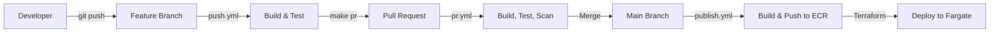

# Paved Paths Architecture Context

> **Extracted architecture context for Alight's Paved Paths framework to enable automated onboarding of non-compliant repositories.**

---

## Overview

This repository contains the extracted knowledge, documentation, and tooling to understand and validate compliance with Alight's **Paved Paths** standardized development framework.

### What are Paved Paths?

Paved Paths is Alight's standardized software development framework that provides:

| Capability | Description |
|------------|-------------|
| **CI/CD Pipelines** | Pre-configured GitHub Actions with reusable workflows |
| **Project Structure** | Standardized configuration files across all projects |
| **Container Deployment** | Automated builds and deployment to AWS ECS Fargate |
| **Versioning** | Semantic versioning via Commitizen with conventional commits |
| **Security** | Pre-commit hooks for secrets detection, Checkmarx scanning |
| **Developer Experience** | VS Code devcontainers with pre-configured environments |

### Paved Path Types

| Type | Template | Language | Runtime |
|------|----------|----------|---------|
| `SpringbootAPI` | dx-template-springboot | Java | Container (Fargate) |
| `PythonLambda` | dx-template-python | Python | Lambda |
| `AngularApp` | dx-template-angular | TypeScript | Static |
| `Docker` | dx-template-docker | Any | Container |
| `HTML` | dx-template-html | HTML | Static |
| `JavaApp` | dx-template-java | Java | Container |

---

## Repository Structure

```
context-paved-paths/
├── manifests/                    # Repository manifest files
│   ├── template_repos.manifest.json    # Template repository list
│   └── repositories.manifest.json      # Supporting tools list
│
├── pages/                        # SharePoint documentation (MHTML)
│   ├── Paved Paths.mhtml
│   ├── Getting Started with Paved Paths.mhtml
│   └── ...
│
├── prompts/                      # AI prompts for automation
│   └── validate_paved_path.md        # Compliance validation prompt
│
├── repositories/                 # Cloned source repositories
│   ├── dx-template-*/                # Template repositories (7)
│   └── dx-tools/                     # Supporting tool repos (19)
│
├── results/                      # Generated artifacts
│   ├── architecture_context.md       # Human-readable architecture doc
│   ├── architecture_context.json     # Structured data for automation
│   ├── knowledge.md                  # Project knowledge base
│   ├── inventory.md                  # Complete repo inventory
│   └── copilot-instructions.md       # Copilot code review rules
│
└── master_prompt.md              # Original extraction prompt
```

---

## Generated Artifacts

### For Humans

| File | Purpose | Use Case |
|------|---------|----------|
| [results/architecture_context.md](results/architecture_context.md) | Complete architecture documentation | Understanding Paved Paths, audits, onboarding |
| [results/inventory.md](results/inventory.md) | Repository catalog with descriptions | Finding the right repo for your needs |
| [results/knowledge.md](results/knowledge.md) | Project knowledge base | Quick reference, evidence log |

### For Automation

| File | Purpose | Use Case |
|------|---------|----------|
| [results/architecture_context.json](results/architecture_context.json) | Structured architecture data | Tooling, validation scripts, automation |
| [results/copilot-instructions.md](results/copilot-instructions.md) | AI code review rules | Copilot-powered PR reviews |
| [prompts/validate_paved_path.md](prompts/validate_paved_path.md) | Compliance validation prompt | Testing repos for Paved Path compliance |

---

## Quick Start

### 1. Validate a Repository

Use the validation prompt to check if a repository is Paved Path compliant:

```
1. Open GitHub Copilot Chat
2. Attach: prompts/validate_paved_path.md
3. Ask: "Validate: C:\path\to\your-repo"
```

### 2. Understand Required Files

Every Paved Path repository needs these 10 items:

| File | Purpose |
|------|---------|
| `.alit.json` | Paved path configuration (artifact name, BSN, type) |
| `.cz.json` | Commitizen semantic versioning |
| `.pre-commit-config.yaml` | Pre-commit hooks (secrets, linting) |
| `Makefile` | Standard dev commands (init, build, test, pr) |
| `.github/workflows/init.yml` | Repository initialization |
| `.github/workflows/pr.yml` | Pull request validation |
| `.github/workflows/push.yml` | Feature branch push |
| `.github/workflows/publish.yml` | Main branch publish |
| `.devcontainer/` | VS Code devcontainer config |
| `README.md` | Project documentation |

### 3. Create a New Paved Path Project

```bash
# Install dx-cli
pip install dx-cli --trusted-host artifactory.alight.com \
  -i https://artifactory.alight.com/artifactory/api/pypi/dx-pypi-virtual/simple

# Run the CLI and select "Create new repository"
dx
```

---

## Key Concepts

### CI/CD Flow



### Workflow Hierarchy

All repository workflows delegate to reusable workflows in `dx-automation`:

```
your-repo/.github/workflows/publish.yml
    └── uses: AlightEngineering/dx-automation/.github/workflows/java-paved-path-publish.yml@main
```

### Release Management Service (RMS)

The [dx-release-management](https://github.com/AlightEngineering/dx-release-management) service:
- Injects quality gates into deployments
- Updates JIRA tickets with build/deploy status
- Validates ServiceNow change requests
- Enforces BSN approver permissions

---

## Repository Inventory

### Template Repositories (Start New Projects)

| Repository | Description |
|------------|-------------|
| [dx-template-springboot](https://github.com/AlightEngineering/dx-template-springboot) | Spring Boot REST API |
| [dx-template-python](https://github.com/AlightEngineering/dx-template-python) | Python Lambda |
| [dx-template-angular](https://github.com/AlightEngineering/dx-template-angular) | Angular SPA |
| [dx-template-docker](https://github.com/AlightEngineering/dx-template-docker) | Docker container |
| [dx-template-html](https://github.com/AlightEngineering/dx-template-html) | Static HTML site |
| [dx-template-java](https://github.com/AlightEngineering/dx-template-java) | Java web app |
| [dx-template-tfsolution-fargate](https://github.com/AlightEngineering/dx-template-tfsolution-fargate) | Terraform Fargate IaC |

### Key Supporting Repositories

| Repository | Purpose |
|------------|---------|
| [dx-automation](https://github.com/AlightEngineering/dx-automation) | Reusable GitHub Actions workflows |
| [dx-cli](https://github.com/AlightEngineering/dx-cli) | Developer CLI tool |
| [dx-release-management](https://github.com/AlightEngineering/dx-release-management) | Release Management Service |
| [dx-containers](https://github.com/AlightEngineering/dx-containers) | DevContainer images |

See [results/inventory.md](results/inventory.md) for the complete list of 26 repositories.

---

## Infrastructure

### Container Registry

```
755600509381.dkr.ecr.us-east-1.amazonaws.com
```

All container images are published to AWS ECR in the `alight-prod-devops` account.

### Artifact Repositories

| Type | Location |
|------|----------|
| Container Images | AWS ECR (above) |
| Python Packages | `artifactory.alight.com/artifactory/api/pypi/dx-pypi-virtual/simple` |
| Java Libraries | `artifactory.alight.com/artifactory/dx-libs-release-local` |

---

## Onboarding a Non-Compliant Repository

### Step 1: Validate Current State

```bash
# Using the validation prompt
# Attach prompts/validate_paved_path.md to Copilot and ask to validate your repo
```

### Step 2: Copy Required Files

From the appropriate template (e.g., `dx-template-springboot`):
- `.alit.json` → customize `artifact.name`, `BusinessServiceName`, `paved_path`
- `.cz.json` → copy as-is
- `.pre-commit-config.yaml` → copy as-is
- `Makefile` → copy as-is
- `.github/workflows/*` → copy all 4 files
- `.devcontainer/` → copy and customize

### Step 3: Configure `.alit.json`

```json
{
    "build": {
        "artifact": {
            "name": "your-app-name-lowercase",
            "BusinessServiceName": "Your BSN from ServiceNow"
        },
        "paved_path": "SpringbootAPI"
    }
}
```

### Step 4: Initialize

```bash
make init
```

### Step 5: Verify

```bash
make pre-commit
```

---

## Contributing

This repository is auto-generated from analysis of Paved Paths documentation and template repositories. To update:

1. Re-run the extraction using `master_prompt.md`
2. Clone any new template repositories
3. Regenerate the artifacts in `results/`

---

## References

- [Paved Paths SharePoint](https://alightsolutionsllc.sharepoint.com/sites/earef/SitePages/Paved-Paths.aspx)
- [dx-automation Documentation](https://github.com/AlightEngineering/dx-automation/blob/main/docs)
- [DX CLI README](https://github.com/AlightEngineering/dx-cli)

---

*Generated: January 2026*
