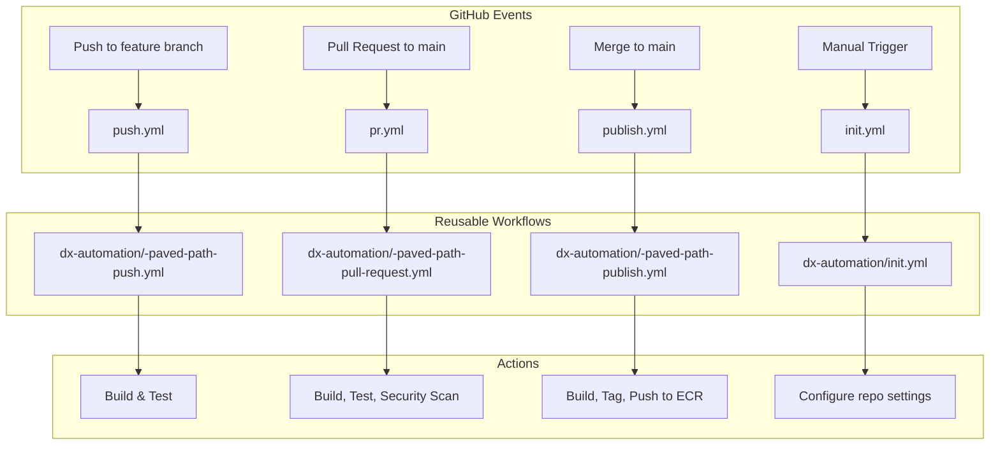
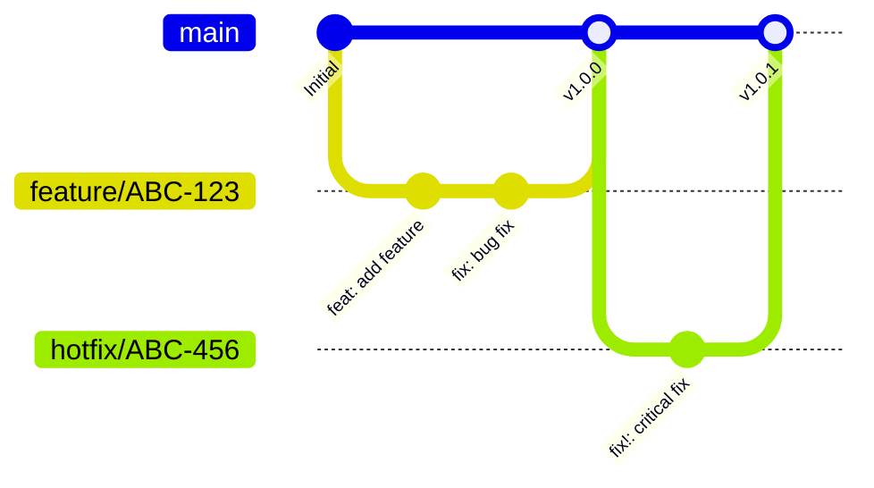
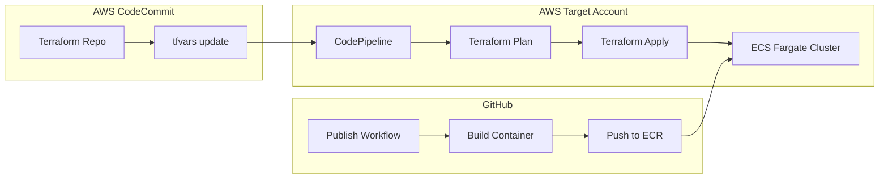
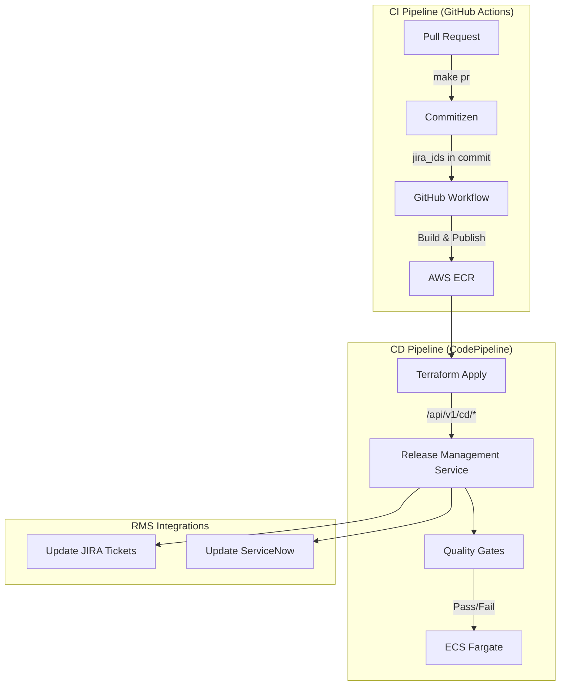

# Alight Paved Paths Architecture Context

> **Purpose**: This document defines the complete architecture context of Alight's "Paved Paths" standardized development framework. It is designed to enable automated onboarding of non-compliant repositories to Paved Path standards.

---

## 1. Executive Summary

**Paved Paths** is Alight's standardized software development framework that provides:
- Pre-configured CI/CD pipelines via GitHub Actions
- Standardized project structures with required configuration files
- Automated container builds and deployment to AWS ECS Fargate
- Consistent tooling for versioning, commits, and security scanning
- Developer experience (DX) tooling via VS Code devcontainers

### Key Principles
1. **Trunk-based Development**: Single long-lived branch (`main`) with short-lived feature branches
2. **Semantic Versioning**: Enforced via Commitizen with conventional commit messages
3. **Security by Default**: Pre-commit hooks for secrets detection, Checkmarx scanning
4. **Infrastructure as Code**: Terraform-based deployments via CodePipeline

---

## 2. Repository Structure Inventory

### 2.1 Paved Path Types

| Paved Path Type | Template Repository | Description |
|-----------------|---------------------|-------------|
| `SpringbootAPI` | `dx-template-springboot` | Java Spring Boot REST APIs |
| `PythonLambda` | `dx-template-python` | Python AWS Lambda functions |
| `AngularApp` | `dx-template-angular` | Angular single-page applications |
| `Docker` | `dx-template-docker` | Custom Docker container images or importing external images to Alight ECR |
| `HTML` | `dx-template-html` | Static HTML sites |
| `JavaApp` | `dx-template-java` | Java web applications |
| `JavaWebApp` | `dx-template-java-webapp` | JSP/Servlet-based Java apps requiring an application server |

### 2.2 Required Files for Paved Path Compliance

Every Paved Path compliant repository **MUST** contain:

| File | Purpose | Modifiable |
|------|---------|------------|
| `.alit.json` | Paved path configuration (artifact name, BSN, type) | ✅ Yes (values only) |
| `.cz.json` | Commitizen semantic versioning configuration | ❌ No |
| `.pre-commit-config.yaml` | Pre-commit hooks configuration | ❌ No |
| `Makefile` | Standard development commands | ❌ No |
| `.github/workflows/init.yml` | Repository initialization workflow | ❌ No |
| `.github/workflows/pr.yml` | Pull request validation workflow | ❌ No |
| `.github/workflows/push.yml` | Branch push workflow | ❌ No |
| `.github/workflows/publish.yml` | Main branch publish workflow | ❌ No |
| `.devcontainer/` | VS Code devcontainer configuration | ⚠️ Limited |
| `README.md` | Project documentation | ✅ Yes |

---

## 3. Configuration File Specifications

### 3.1 `.alit.json` - Paved Path Configuration

This is the **primary configuration file** that identifies a repository as Paved Path compliant.

```json
{
    "build": {
        "artifact": {
            "name": "<lowercase-artifact-name>",
            "BusinessServiceName": "<BSN from ServiceNow>"
        },
        "paved_path": "<PavedPathType>"
    }
}
```

**Validation Rules:**
- `build.artifact.name` MUST be lowercase (enforced by pre-commit hook)
- `build.artifact.name` becomes the ECR repository name
- `build.paved_path` MUST match one of the defined Paved Path types

**Extended Fields by Type:**

| Paved Path | Additional Fields |
|------------|-------------------|
| `Docker` | `external_image.is_external`, `external_image.is_private`, `external_image.metadata.registry_uri` |
| `PythonLambda` | `build.artifact.is_layer` |

### 3.2 `.cz.json` - Commitizen Configuration

Controls semantic versioning and commit message formats.

```json
{
  "commitizen": {
    "name": "cz_customize",
    "tag_format": "$version",
    "version_scheme": "semver2",
    "version": "0.0.0",
    "update_changelog_on_bump": false,
    "major_version_zero": true
  }
}
```

**Key Rules:**
- **`major_version_zero`**: MUST be flipped to `false` when ready to create the first releasable artifact
- When `version` major > 0, `update_changelog_on_bump` MUST be `true`
- Uses conventional commit format: `type(scope): message`
- Requires JIRA IDs in commit footer

### 3.3 `.pre-commit-config.yaml` - Pre-commit Hooks

Required hooks include:

| Hook | Repository | Purpose |
|------|------------|---------|
| `check-yaml` | pre-commit-hooks | Validate YAML syntax |
| `end-of-file-fixer` | pre-commit-hooks | Ensure files end with newline |
| `trailing-whitespace` | pre-commit-hooks | Remove trailing whitespace |
| `check-case-conflict` | pre-commit-hooks | Prevent case conflicts |
| `check-merge-conflict` | pre-commit-hooks | Detect merge conflict markers |
| `commitizen` | commitizen-tools | Validate commit messages |
| `detect-secrets` | Yelp/detect-secrets | Prevent secrets in code |
| `validate-artifact-name-lowercase` | local | Ensure ECR name is lowercase |

### 3.4 `Makefile` - Standard Commands

All Paved Path repositories expose these standard `make` targets:

| Command | Description |
|---------|-------------|
| `make init` | Initialize development environment |
| `make build` | Build the application/container |
| `make test` | Run tests |
| `make pre-commit` | Run all pre-commit hooks |
| `make push` | Push changes to feature branch |
| `make pr` | Create pull request to main |
| `make ecr-login` | Authenticate to AWS ECR |

---

## 4. CI/CD Pipeline Architecture

### 4.1 Workflow Triggers



### 4.2 Reusable Workflow References

All workflows delegate to central reusable workflows in `AlightEngineering/dx-automation`:

| Paved Path Type | Push Workflow | PR Workflow | Publish Workflow |
|-----------------|---------------|-------------|------------------|
| Java/SpringBoot | `java-paved-path-push.yml` | `java-paved-path-pull-request.yml` | `java-paved-path-publish.yml` |
| Python | `python-paved-path-push.yml` | `python-paved-path-pull-request.yml` | `python-paved-path-publish.yml` |
| Docker | `docker-paved-path-push.yml` | `docker-paved-path-pull-request.yml` | `docker-paved-path-publish.yml` |
| Angular | `angular-paved-path-push.yml` | `angular-paved-path-pull-request.yml` | `angular-paved-path-publish.yml` |
| HTML | `html-paved-path-push.yml` | `html-paved-path-pull-request.yml` | `html-paved-path-publish.yml` |

### 4.3 Branching Strategy



**Rules:**
- `main` is the ONLY long-lived branch
- Feature branches: `feature/<jira-id>-description`
- Hotfix branches: `hotfix/<jira-id>-description`
- All merges to `main` trigger automatic versioning and tagging

> **Note**: The hotfix strategy is not yet fully defined. Consult DX team for current guidance.

---

## 5. Deployment Architecture

### 5.1 Container Registry

- **Registry**: AWS ECR in `alight-prod-devops` account
- **URI**: `755600509381.dkr.ecr.us-east-1.amazonaws.com`
- **Image Naming**: `{registry}/{artifact.name}:{version}`

### 5.2 Fargate Deployment Flow



### 5.3 Infrastructure Components (Terraform)

The `dx-template-tfsolution-fargate` template provides:

| Resource | Terraform File | Description |
|----------|----------------|-------------|
| ECS Cluster | `ecs-cluster.tf` | Fargate cluster definition |
| ECS Task | `ecs-task.tf` | Container task definitions |
| ALB (Private) | `alb-private.tf` | Private Application Load Balancer |
| ALB (Public) | `alb-public.tfx` | Public ALB (optional, disabled by default) |
| NLB | `nlb.tfx` | Network Load Balancer (optional) |
| EFS | `efs.tf` | Elastic File System for persistent storage |
| S3 | `s3.tf` | S3 bucket for application data |
| Route53 | `alb-private-route53.tf` | Private DNS records |

---

## 6. Developer Experience (DX)

### 6.1 Required Tooling

| Tool | Installation | Purpose |
|------|--------------|---------|
| Docker Desktop | Manual | Container runtime (only required on Alight Windows laptops) |
| VS Code | Manual | IDE with devcontainer support |
| dx-cli | `pip install dx-cli --trusted-host artifactory.alight.com -i https://artifactory.alight.com/artifactory/api/pypi/dx-pypi-virtual/simple` | Alight CLI tool |
| GitHub CLI | Manual | Git operations |

### 6.2 Devcontainer Configuration

All templates include `.devcontainer/` with:
- Pre-configured development environment (Docker Compose used in some templates, not all)
- Zscaler certificate handling (`NODE_EXTRA_CA_CERTS` for Node.js templates)
- VS Code extensions pre-installed (Checkmarx, language-specific)

**Environment Variables (vary by template):**
```json
{
    "ENV": "localdev",
    "NODE_EXTRA_CA_CERTS": "/etc/ssl/certs/ZscalerRootCertificate-2048-SHA256.pem"
}
```

---

## 7. Onboarding Checklist

### 7.1 Minimum Requirements for Paved Path Compliance

To onboard a repository to Paved Paths, ensure:

- [ ] **`.alit.json`** exists with valid `paved_path` type and `artifact.name`
- [ ] **`.cz.json`** exists with commitizen configuration
- [ ] **`.pre-commit-config.yaml`** exists with required hooks
- [ ] **`Makefile`** exists with standard targets
- [ ] **`.github/workflows/`** contains all 4 workflow files (init, pr, push, publish)
- [ ] **`.devcontainer/`** exists with valid configuration
- [ ] **`README.md`** documents the project and Paved Path usage
- [ ] Branching strategy follows trunk-based development (main only)
- [ ] No secrets or credentials in source code
- [ ] Container image published to approved ECR registry

---

## 9. Standards Mapping

| Standard | Implementation | Enforcement |
|----------|----------------|-------------|
| Trunk-based Development | Single `main` branch | PR workflow blocks direct push |
| Semantic Versioning | Commitizen + `.cz.json` | Pre-commit hook validates |
| Conventional Commits | Commitizen templates | Pre-commit `commitizen` hook |
| Secrets Detection | detect-secrets | Pre-commit hook |
| Container Security | Checkmarx scanning | PR workflow |
| Infrastructure as Code | Terraform templates | CodePipeline deployment |
| Developer Environment | Devcontainers | `.devcontainer/` config |

---

## 10. Release Management Service (RMS)

The Release Management Service is a critical backend component that integrates with Paved Paths CI/CD pipelines.

### 10.1 RMS Overview

| Aspect | Description |
|--------|-------------|
| **Technology** | FastAPI (Python) |
| **Repository** | [dx-release-management](https://github.com/AlightEngineering/dx-release-management) |
| **Purpose** | Quality gates, JIRA/ServiceNow integration, release metrics |

### 10.2 RMS Capabilities



> **Note**: Quality gates are enforced during the CD phase (CodePipeline), not during CI (GitHub Actions).

### 10.3 Quality Gates

| Gate | Description | Enforcement |
|------|-------------|-------------|
| SNOW Change Compliance | Validates ServiceNow change request exists and is approved | CD deployment blocked if failed |
| BSN Approver Validation | Validates deployer has approval rights for Business Service | CD deployment blocked if failed |

> **Note**: This list is actively being expanded. Additional quality gates are in development.

### 10.4 JIRA Integration

During `make pr`, developers enter JIRA IDs which are embedded in commit messages. The Publish workflow automatically:
1. Updates `BuildArtifacts` field on linked JIRAs
2. Updates `DeployStatus` field on linked JIRAs

> **Note**: JIRA IDs must be entered during `make pr`. Editing the PR description after creation does NOT update the JIRA tracking.

---

## 11. Supporting Infrastructure

### 11.1 Base Docker Images

All application containers inherit from approved base images:

| Image | Repository | Purpose |
|-------|------------|---------|
| `dx-alpine` | [dx-alpine](https://github.com/AlightEngineering/dx-alpine) | Alpine Linux with Alight certs |
| `dx-node` | [dx-node](https://github.com/AlightEngineering/dx-node) | Node.js runtime |
| `dx-python` | [dx-python](https://github.com/AlightEngineering/dx-python) | Python runtime |

| `dx-base-fastapi` | [dx-base-fastapi](https://github.com/AlightEngineering/dx-base-fastapi) | FastAPI Python base |

### 11.2 Developer CLI (dx-cli)

| Feature | Environment | Status |
|---------|-------------|--------|
| Create GitHub repos from templates | Windows/Linux | ✅ Done |
| Validate software prerequisites | Windows/Linux | ✅ Done |
| Self-updating | All | ✅ Done |
| Base64 encode config files for Terraform | Windows/Linux | ✅ Done |
| Configuration management in devcontainers | Docker (devcontainer) | ✅ Done |
| Initialize AWS CodeCommit repo with terraform template | Windows/Linux | ✅ Done |
| Detect and fix template drift | Docker (devcontainer) | 🔄 In Progress |
| Validate `.alit.json` | Docker (devcontainer) | 📋 Planned |

**Installation:**
```bash
pip install dx-cli --trusted-host artifactory.alight.com \
  -i https://artifactory.alight.com/artifactory/api/pypi/dx-pypi-virtual/simple
```

### 11.3 DevContainers

DevContainers are built and published from [dx-containers](https://github.com/AlightEngineering/dx-containers):

| Container | Use Case |
|-----------|----------|
| `dx-devcontainer-java` | Java/Spring Boot development |
| `dx-devcontainer-python` | Python development |
| `dx-devcontainer-node` | Angular/Node.js development |
| `dx-devcontainer-docker` | Docker image development |

### 11.4 Custom Terraform Provider

[dx-tf-alight-provider](https://github.com/AlightEngineering/dx-tf-alight-provider) provides custom Terraform functions:

| Function | Description |
|----------|-------------|
| `strip_comments(source_path)` | Removes comments from config files |

---

## 12. Docker Paved Path Image Tagging Strategy

> **Scope**: This section applies specifically to the **Docker paved path** (`dx-template-docker`) for creating custom images or importing external images to Alight ECR.

The Docker paved path uses a layered image tagging strategy that preserves lineage:

| Image Type | Tag Format | Example |
|------------|------------|---------|
| External Import | `{name}:{ext_version}-$META` | `alpine:3.19.0-1` |
| Internal Base | `{name}:{semver}` | `my_base:1.2.3` |
| App on Base | `{name}:{app_semver}-{base}-{base_semver}` | `my_app:1.0.0-my_base-1.2.3` |
| App on External | `{name}:{app_semver}-{ext}-{ext_ver}-$META` | `my_app:1.0.0-alpine-3.19.0-1` |

> **$META** is incremented when security patches are applied to external images.

---

## Appendix A: Template Repository Manifest

Source: [manifests/template_repos.manifest.json](../manifests/template_repos.manifest.json)

**Application Templates:**

| Repository | Paved Path Type | Description |
|------------|-----------------|-------------|
| dx-template-springboot | SpringbootAPI | Spring Boot REST API template |
| dx-template-python | PythonLambda | Python AWS Lambda template |
| dx-template-angular | AngularApp | Angular SPA template |
| dx-template-docker | Docker | Docker container or external image import template |
| dx-template-html | HTML | Static HTML site template |
| dx-template-java | JavaApp | Java web application template |
| dx-template-java-webapp | JavaWebApp | JSP/Servlet-based Java apps |

**Infrastructure Templates:**

| Repository | Description |
|------------|-------------|
| dx-template-tfsolution-fargate | Terraform Fargate IaC template |
| dx-template-terraform-modules-ecs | ECS Terraform modules |
| dx-template-terraform-modules-alb | ALB Terraform modules |
| dx-template-terraform-modules-efs | EFS Terraform modules |
| dx-template-terraform-modules-nlb | NLB Terraform modules |
| dx-template-terraform-modules-rds | RDS Terraform modules |
| dx-template-terraform-modules-s3 | S3 Terraform modules |

---

## Appendix B: Supporting Tools Repository Manifest

Source: [manifests/repositories.manifest.json](../manifests/repositories.manifest.json)

| Repository | Category | Description |
|------------|----------|-------------|
| dx-automation | CI/CD | Central reusable GitHub Actions workflows |
| dx-cli | Developer Tool | Command-line tool for DX operations |
| dx-release-management | Service | Release Management Service (quality gates, JIRA/SNOW) |
| dx-containers | DevContainers | VS Code devcontainer images |
| dx-alpine | Base Image | Alpine Linux base |
| dx-node | Base Image | Node.js runtime base |
| dx-python | Base Image | Python runtime base |
| dx-base-fastapi | Base Image | FastAPI Python base |
| dx-lib-java | Library | Java libraries (S3 download, etc.) |
| dx-tf-alight-provider | IaC | Custom Terraform provider |
| dx-vms | Infrastructure | Packer templates for Vagrant boxes |
| dx-action-runner | CI/CD | GitHub Actions runner config |
| dx-developer-doc | Documentation | Internal DX team docs |

---

## Appendix C: Complete Repository Inventory

For a detailed inventory of all repositories with descriptions and use cases, see [inventory.md](inventory.md).

---

*Document generated from Paved Paths template and tools repository analysis.*
*Last Updated: Auto-generated*
