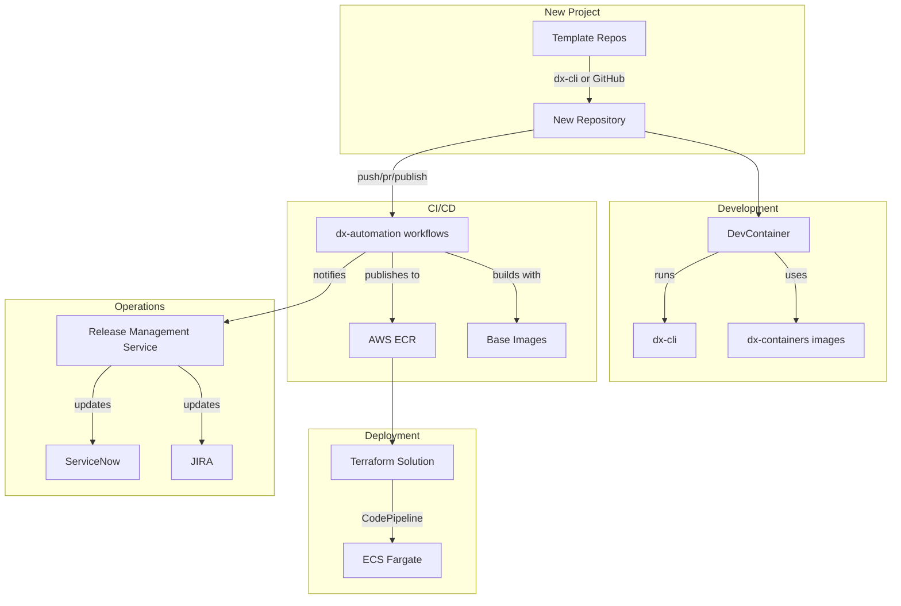

# Alight Paved Paths Repository Inventory

> **Purpose**: Complete inventory of all repositories related to the Developer Experience (DX) and Paved Paths framework. Use this guide to understand which repositories are relevant for your needs.

---

## Quick Reference

| Category | Count | Description |
|----------|-------|-------------|
| [Template Repositories](#template-repositories) | 8 | Starting points for new projects |
| [CI/CD & Automation](#cicd--automation) | 2 | GitHub Actions and workflow orchestration |
| [Base Docker Images](#base-docker-images) | 7 | Foundation container images |
| [Developer Tools](#developer-tools) | 3 | CLI and dev utilities |
| [Terraform & IaC](#terraform--iac) | 1 | Infrastructure as Code providers |
| [Services](#services) | 2 | Platform services (RMS, metrics) |
| [Libraries](#libraries) | 2 | Shared code libraries |
| [Misc/Examples](#miscexamples) | 2 | Example implementations |

---

## Template Repositories

These are the **starting points** for creating new Paved Path compliant projects. Use `dx-cli` or GitHub template features to create new repos from these.

| Repository | Paved Path Type | Language | Description |
|------------|-----------------|----------|-------------|
| [dx-template-springboot](https://github.com/AlightEngineering/dx-template-springboot) | `SpringbootAPI` | Java | Spring Boot REST API template with Gradle, actuator endpoints, and Fargate deployment |
| [dx-template-python](https://github.com/AlightEngineering/dx-template-python) | `PythonLambda` | Python | AWS Lambda function template with layer support |
| [dx-template-angular](https://github.com/AlightEngineering/dx-template-angular) | `AngularApp` | TypeScript | Angular single-page application template |
| [dx-template-docker](https://github.com/AlightEngineering/dx-template-docker) | `Docker` | Any | Template for custom Docker images or importing external images to Alight ECR |
| [dx-template-html](https://github.com/AlightEngineering/dx-template-html) | `HTML` | HTML/CSS/JS | Static HTML website template |
| [dx-template-java](https://github.com/AlightEngineering/dx-template-java) | `JavaApp` | Java | Java web application template (Tomcat-based) |
| [dx-template-java-webapp](https://github.com/AlightEngineering/dx-template-java-webapp) | `JavaWebApp` | Java | JSP/Servlet-based Java apps requiring an application server |
| [dx-template-tfsolution-fargate](https://github.com/AlightEngineering/dx-template-tfsolution-fargate) | N/A (IaC) | Terraform | Terraform solution for deploying applications to ECS Fargate |

### When to Use Each Template

| If you need to... | Use this template |
|-------------------|-------------------|
| Build a REST API in Java | `dx-template-springboot` |
| Create an AWS Lambda function | `dx-template-python` |
| Build a frontend web application | `dx-template-angular` |
| Create a custom Docker image | `dx-template-docker` |
| Import an external Docker image | `dx-template-docker` (with `external_image` config) |
| Deploy a simple static website | `dx-template-html` |
| Build a traditional Java web app (WAR) | `dx-template-java` |
| Build a JSP/Servlet-based app | `dx-template-java-webapp` |
| Deploy to AWS Fargate | `dx-template-tfsolution-fargate` |

---

## CI/CD & Automation

These repositories contain the **reusable GitHub Actions workflows** that power all Paved Path CI/CD pipelines.

| Repository | Description | Key Contents |
|------------|-------------|--------------|
| [dx-automation](https://github.com/AlightEngineering/dx-automation) | **Central reusable workflows** for all Paved Paths. All template repos call workflows from here. | Workflows for: `docker`, `java`, `java-lib`, `python`, `spa` paved paths. Also contains `init.yml` for repo initialization. |
| [dx-action-runner](https://github.com/AlightEngineering/dx-action-runner) | GitHub Actions self-hosted runner configuration | Runner setup for CodeBuild integration |

### Workflows in dx-automation

| Workflow | Paved Path | Trigger |
|----------|------------|---------|
| `docker-paved-path-*.yml` | Docker | push, pr, publish |
| `java-paved-path-*.yml` | SpringBoot, JavaApp, JavaWebApp | push, pr, publish |
| `java-lib-paved-path-*.yml` | Java Libraries | push, pr, publish |
| `python-paved-path-*.yml` | Python Lambda | push, pr, publish |
| `python-lib-paved-path-*.yml` | Python Libraries | push, pr, publish |
| `spa-paved-path-*.yml` | Angular, HTML | push, pr, publish |
| `init.yml` | All | Manual/workflow_dispatch |
| `release-gate-map-*.yml` | RMS | Quality gate configuration |

---

## Base Docker Images

These repositories contain **approved base images** that application containers should inherit from.

| Repository | Image Type | Description |
|------------|------------|-------------|
| [dx-alpine](https://github.com/AlightEngineering/dx-alpine) | OS Base | Alpine Linux base image with Alight certificates |
| [dx-node](https://github.com/AlightEngineering/dx-node) | Runtime | Node.js runtime base image |
| [dx-python](https://github.com/AlightEngineering/dx-python) | Runtime | Python runtime base image |
| [dx-distroless](https://github.com/AlightEngineering/dx-distroless) | Minimal | Distroless base images for minimal attack surface |
| [dx-base-fastapi](https://github.com/AlightEngineering/dx-base-fastapi) | Framework | FastAPI Python base image |
| [dx-containers](https://github.com/AlightEngineering/dx-containers) | DevContainers | VS Code devcontainer images for all paved paths |
| [dx-vms](https://github.com/AlightEngineering/dx-vms) | VM/Vagrant | Packer templates for building Vagrant boxes (Rocky Linux) |

### Image Naming Convention

All images are published to: `755600509381.dkr.ecr.us-east-1.amazonaws.com/<image-name>:<version>`

---

## Developer Tools

Tools that developers use **locally** for development and project management.

| Repository | Tool | Description | Installation |
|------------|------|-------------|--------------|
| [dx-cli](https://github.com/AlightEngineering/dx-cli) | `dx` command | Main developer CLI for: creating new repos, updating templates, validating prerequisites, drift detection, config management, CodeCommit initialization | `pip install dx-cli --trusted-host artifactory.alight.com -i https://artifactory.alight.com/artifactory/api/pypi/dx-pypi-virtual/simple` |
| [dx-developer-doc](https://github.com/AlightEngineering/dx-developer-doc) | Documentation | Internal DX team documentation (not end-user docs) | N/A |
| [dx-containers](https://github.com/AlightEngineering/dx-containers) | DevContainers | VS Code devcontainer definitions | Used automatically via `.devcontainer/` |

### dx-cli Features

| Environment | Feature | Status |
|-------------|---------|--------|
| Windows/Linux | Self-updating | ✅ Done |
| Windows/Linux | Validate software prerequisites | ✅ Done |
| Windows/Linux | Create GitHub repos from templates | ✅ Done |
| Windows/Linux | Base64 encode config files for Terraform | ✅ Done |
| Windows/Linux | Initialize AWS CodeCommit repo with terraform template | ✅ Done |
| Docker (devcontainer) | Self-updating | ✅ Done |
| Docker (devcontainer) | Configuration management in devcontainers | ✅ Done |
| Docker (devcontainer) | Detect and fix template drift | 🔄 In Progress |
| Docker (devcontainer) | Validate `.alit.json` | 📋 Planned |

---

## Terraform & IaC

Infrastructure as Code tools and providers.

| Repository | Description | Use Case |
|------------|-------------|----------|
| [dx-tf-alight-provider](https://github.com/AlightEngineering/dx-tf-alight-provider) | Custom Terraform provider for Alight-specific functions | Use `strip_comments()` function and other Alight-specific Terraform utilities |

---

## Services

Backend services that power the Paved Paths platform.

| Repository | Service | Description |
|------------|---------|-------------|
| [dx-release-management](https://github.com/AlightEngineering/dx-release-management) | **Release Management Service (RMS)** | FastAPI service that: injects quality gates into deployments, updates JIRA/ServiceNow tickets with build status, enables natural-language queries for release metrics |
| [dx-release-metrics-dx-service-image](https://github.com/AlightEngineering/dx-release-metrics-dx-service-image) | RMS Docker Image | Dockerfile for building the RMS container (temporary repo until monorepo support) |

---

## Libraries

Shared code libraries used across multiple projects.

| Repository | Language | Description |
|------------|----------|-------------|
| [dx-lib-java](https://github.com/AlightEngineering/dx-lib-java) | Java | Java libraries including `dx-s3-download` for downloading S3 objects |
| [dx-mcpcommonshared-util](https://github.com/AlightEngineering/dx-mcpcommonshared-util) | Java | MCP-specific shared Java utilities |

---

## Misc/Examples

Example implementations and cross-platform integrations.

| Repository | Description |
|------------|-------------|
| [spark-dx-springboot](https://github.com/AlightEngineering/spark-dx-springboot) | Example Spring Boot application using Paved Path patterns |
| [data-platform-kafka-admin-layer](https://github.com/AlightEngineering/data-platform-kafka-admin-layer) | Kafka administration layer (Data Platform specific) |

---

## Repository Categories Summary

---

## How to Find What You Need

| Question | Answer |
|----------|--------|
| "I want to start a new project" | Use a [Template Repository](#template-repositories) via `dx-cli` |
| "I need to modify CI/CD pipelines" | Look at [dx-automation](https://github.com/AlightEngineering/dx-automation) |
| "I want to create a new base image" | Check [Base Docker Images](#base-docker-images) for patterns |
| "I need help with the developer CLI" | See [dx-cli](https://github.com/AlightEngineering/dx-cli) |
| "I want to understand quality gates" | See [dx-release-management](https://github.com/AlightEngineering/dx-release-management) |
| "I need Terraform utilities" | See [dx-tf-alight-provider](https://github.com/AlightEngineering/dx-tf-alight-provider) |
| "I want to build devcontainers" | See [dx-containers](https://github.com/AlightEngineering/dx-containers) |

---

## Registry & Artifact Locations

| Type | Location |
|------|----------|
| Container Images | `755600509381.dkr.ecr.us-east-1.amazonaws.com` (alight-prod-devops) |
| Python Packages | `https://artifactory.alight.com/artifactory/api/pypi/dx-pypi-virtual/simple` |
| Java Libraries | `https://artifactory.alight.com/artifactory/dx-libs-release-local` |
| Vagrant Boxes | S3 bucket (migrating from Artifactory) |

---

*Last Updated: Auto-generated from repository analysis*
